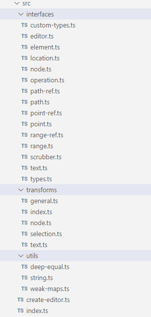
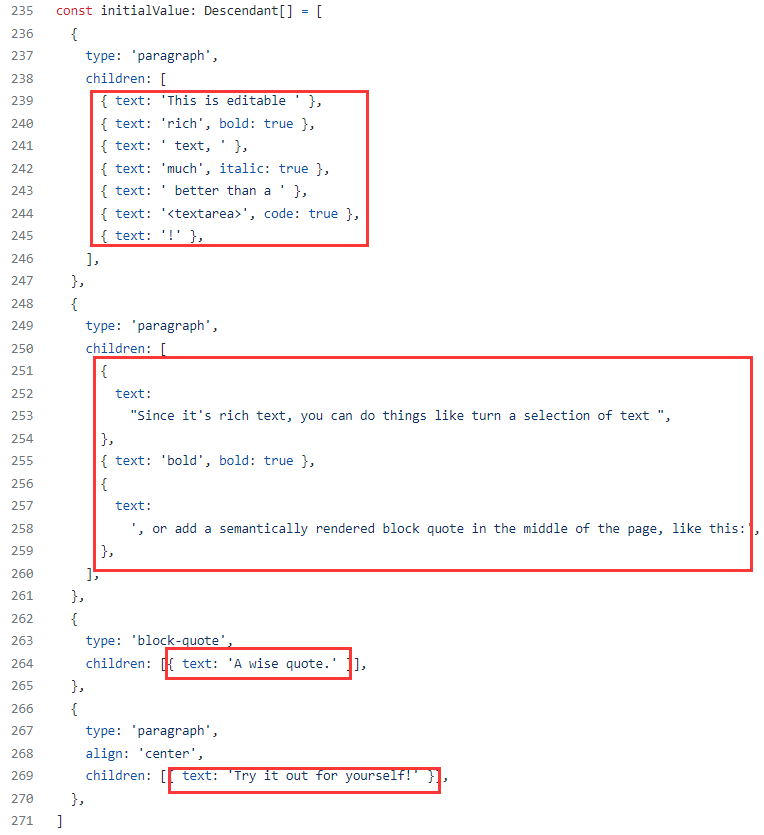
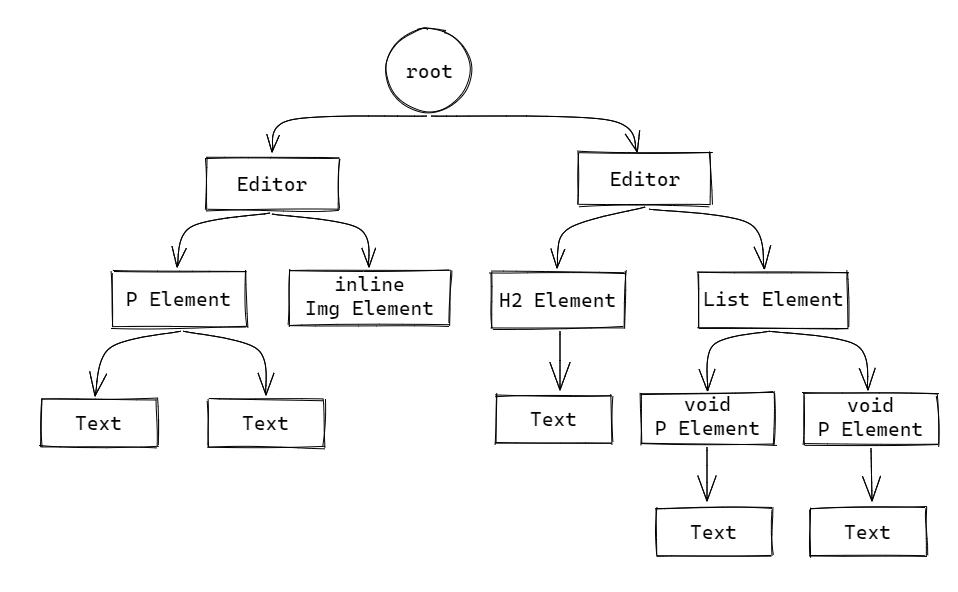

#### 源码架构

首先来看下最核心的slate包下的目录：



可以看到，作为一个开源富文本库，其源码是相当之少。在第一篇文章中说过，Slate没有任何开箱即用的功能，只提供给开发者用于构建富文本所需的最基本的一套schema及操作API。因此源码的体量自然就要少许多。

我们来预览上图中各个目录下文件所负责的功能：

- ***interface***：包含了所有Slate中使用到概念的类型定义以及这些类型所提供的方法API。这其中有用于表示Slate文档树结构的`editor.ts`、`node.ts`、`element.ts`、`text.ts`，表示所有原子化操作的`operation.ts`，以及用于定位相关功能的`point.ts`、`path.ts`、`range.ts`、`location.ts`等。
- ***transforms***：上面提到的`operation`是Slate内部自己使用的原子化操作，但由于过于底层并不适合直接提供给开发者使用（slate-history库就是基于`operation`来实现历史记录的）。便做多一层封装，基于Slate自身的文档树结构提供了一套修改文档内容的方法。transforms中的一个方法往往是一系列`operation`的集合。它分为这么几类应用：用于光标操作的`selection.ts`、用于操作文档树中节点以及节点中文本内容的`node.ts`和`text.ts`、通用方法`general.ts`。
- ***utils***：Slate内部使用的一些辅助函数。


#### 类型拓展

在进一步深入源码之前，我们先来探究下Slate的**custom-types**机制。Slate将所有可供开发者自定义拓展的基础类型以及它们的可拓展能力的实现都放在了***interfaces/custom-types.ts***下[[源码]](https://github.com/ianstormtaylor/slate/blob/slate%400.82.0/packages/slate/src/interfaces/custom-types.ts)：

```typescript
/**
 * Extendable Custom Types Interface
 */

type ExtendableTypes =
  | 'Editor'
  | 'Element'
  | 'Text'
  | 'Selection'
  | 'Range'
  | 'Point'
  | 'Operation'
  | 'InsertNodeOperation'
  | 'InsertTextOperation'
  | 'MergeNodeOperation'
  | 'MoveNodeOperation'
  | 'RemoveNodeOperation'
  | 'RemoveTextOperation'
  | 'SetNodeOperation'
  | 'SetSelectionOperation'
  | 'SplitNodeOperation'

export interface CustomTypes {
  [key: string]: unknown
}

export type ExtendedType<
  K extends ExtendableTypes,
  B
> = unknown extends CustomTypes[K] ? B : CustomTypes[K]
```

笔者在初次使用Slate的时候，依照文档实现自己业务所需要的自定义类型，假设希望我们编辑器中的文本能够有粗体和斜体的样式。

而Slate下默认的文本节点定义中，是只有一个`text`字段表示文本内容的[[源码]](https://github.com/ianstormtaylor/slate/blob/slate%400.82.0/packages/slate/src/interfaces/text.ts#L12)：

```typescript
export interface BaseText {
  text: string
}

export type Text = ExtendedType<'Text', BaseText>
```

这是不够的，依照文档在自己的项目中加入以下代码，为文本节点的定义加入两个新字段用来标识粗体与斜体：

```typescript
declare module 'slate' {
    interface CustomType {
        Text: {
            text: string
            bold?: boolean
            italic?: boolean
        }
    }
}
```

这样就对Slate的文本节点Text类型进行了拓展，并且后续使用相关的API时还能在编辑器/IDE中获得智能提示。

笔者当时很是疑惑如何通过TS实现这种机制的，便找到了***custom-types.ts***中的代码。看完后惊叹于其TS技巧，可以通过简短的数十行就实现了这种类型拓展的能力。分为三个部分：

1. 第一行的`type ExtendableTypes = 'Editor' | 'Element' | 'Text' |...... ` 定义了由一系列字符串组成的联合类型。它包括了Slate中所有允许开发者进行拓展的类型名称。上面示例中的`Text`类型就是其中之一。
   
2. `CustomTypes`是一个以`string`作为key的映射类型，相当于包裹了任意名称的字段并且值都是`unknown`类型。`unknown`与`any`类似，都表示任何值；但不同的是对`unknown`类型值的任何操作都是非法的。利用`interface`声明会自动合并的特性，对我们需要进行拓展的类型通过`declare module`可以覆盖Slate内部`CustomTypes`的默认值`unknown`。

3. 第三部分的`ExtendedType<K, B>`泛型是最精华的部分。这里面的类型变量K被约束为只能传入`ExtendableTypes `中的值，类型变量B则无限制。后边是赋值为一个条件类型：`unknown extends CustomTypes[K] ? B : CustomTypes[K]`。
   `unknown extends CustomTypes[K]`表示`CustomTypes`中以K作为字段的值是否为`unknown`；如果为true就将B作为默认类型返回。不为true的情况则是在开发者拓展了某个类型时发生。例如上面的`Text`类型，当K为"Text"时`CustomTypes['Text']`并不为`unknown`，那么Slate会以我们覆写的`Text: { text: string, bold?: boolean, italic?: boolean }`作为`Text`的真正定义。
   


因此`ExtendedType<K, B>`的作用简单来说就是：当开发者拓展了类型K的时候就使用拓展的定义`CustomTypes[K]`，否则就以B作为默认类型。我们在后续文章中要讲解的类型都是基于它来提供可拓展能力的：

```typescript
// text.ts
export type Text = ExtendedType<'Text', BaseText>
// element.ts
export type Element = ExtendedType<'Element', BaseElement>
// range.ts
export type Range = ExtendedType<'Range', BaseRange>
// editor.ts
export type Editor = ExtendedType<'Editor', BaseEditor>
export type Selection = ExtendedType<'Selection', BaseSelection>
// ......
```


#### text.ts

让我们从最简单的text看起[[源码]](https://github.com/ianstormtaylor/slate/blob/slate%400.82.0/packages/slate/src/interfaces/text.ts)：

```typescript
/**
 * `Text` objects represent the nodes that contain the actual text content of a
 * Slate document along with any formatting properties. They are always leaf
 * nodes in the document tree as they cannot contain any children.
 */

export interface BaseText {
  text: string
}

export type Text = ExtendedType<'Text', BaseText>

export interface TextInterface {
  equals: (text: Text, another: Text, options?: TextEqualsOptions) => boolean
  isText: (value: any) => value is Text
  isTextList: (value: any) => value is Text[]
  isTextProps: (props: any) => props is Partial<Text>
  matches: (text: Text, props: Partial<Text>) => boolean
  decorations: (node: Text, decorations: Range[]) => Text[]
}

export const Text: TextInterface = {
    equals(text: Text, another: Text, options: TextEqualsOptions = {}): boolean {
        // ...
    },
    isText(value: any): value is Text {
        // ...
    },
    // ...
}
```

除了text，其他诸如element、path等概念的文件中也差不多是按照上面这种代码结构排版的。包含1.定义此概念的`ExtendedType`类型  2.定义该类型需要提供给开发者的API  3.以及这组API的具体实现：

```typescript
export type XXType = XX

export interface XXTypeInterface {
    // 该类型拥有的方法定义
}

export const XX: XXTypeInterface {
    // 方法的具体实现
}
```


把视角拉回到`Text`。

text节点代表了Slate文档树中的叶子节点，只能存储文字内容，不能再包含任何子节点。开发者可以根据需要往其中添加别的字段用以描述文本的样式信息。以官方示例中的源码实现来看[[源码]](https://github.com/ianstormtaylor/slate/blob/main/site/examples/richtext.tsx#L235)，下图中红圈的部分代表的都是text节点：




#### element.ts[[源码]](https://github.com/ianstormtaylor/slate/blob/slate%400.82.0/packages/slate/src/interfaces/element.ts)

Slate编辑器的内容是由`Text`和`Element`两种类型组成的。element节点代表了除text文本外的非叶子节点。

```typescript
/**
 * `Element` objects are a type of node in a Slate document that contain other
 * element nodes or text nodes. They can be either "blocks" or "inlines"
 * depending on the Slate editor's configuration.
 */

export interface BaseElement {
  children: Descendant[]
}

export type Element = ExtendedType<'Element', BaseElement>
```

`Element`默认的类型定义中只要求一个名为`children`的`Descendant[]`类型属性。当然开发者一样可以像前面示例那样拓展添加其他的属性。

`Descendant`类型代表Slate文档树中“可以作为子节点”的类型[[源码]](https://github.com/ianstormtaylor/slate/blob/slate%400.82.0/packages/slate/src/interfaces/node.ts#L608)：

```typescript
/**
 * The `Descendant` union type represents nodes that are descendants in the
 * tree. It is returned as a convenience in certain cases to narrow a value
 * further than the more generic `Node` union.
 */

export type Descendant = Element | Text
```

可以看到`Element`和`Descendant`是相互关联的。所以在element节点的`children`下再嵌套放置element节点也是允许的。这就是为什么开发者可以很方便地通过Slate构建拥有复杂树状结构的文档内容，因为只要依照Slate的类型规范走，它并不关注你的文档树的具体结构长什么样，你想嵌套地多深多复杂都可以。

在element.ts文件顶部的注释中说到，`Element`可以被定义为`blocks`或`inlines`形式。这一点是非常地贴近DOM元素的机制，并为开发者在富文本中渲染自定义组件时提供了更多样的可能性。我们在后面还会再看到关于这两个属性的内容。


#### Editor

Slate编辑器的接口文件editor.ts[[源码]](https://github.com/ianstormtaylor/slate/blob/slate%400.82.0/packages/slate/src/interfaces/editor.ts)：

```typescript
export type BaseSelection = Range | null

export type Selection = ExtendedType<'Selection', BaseSelection>

export type EditorMarks = Omit<Text, 'text'>

/**
 * The `Editor` interface stores all the state of a Slate editor. It is extended
 * by plugins that wish to add their own helpers and implement new behaviors.
 */

export interface BaseEditor {
  children: Descendant[]
  selection: Selection
  operations: Operation[]
  marks: EditorMarks | null

  // Schema-specific node behaviors.
  isInline: (element: Element) => boolean
  isVoid: (element: Element) => boolean
  normalizeNode: (entry: NodeEntry) => void
  onChange: () => void

  // Overrideable core actions.
  addMark: (key: string, value: any) => void
  apply: (operation: Operation) => void
  deleteBackward: (unit: TextUnit) => void
  deleteForward: (unit: TextUnit) => void
  deleteFragment: (direction?: TextDirection) => void
  getFragment: () => Descendant[]
  insertBreak: () => void
  insertSoftBreak: () => void
  insertFragment: (fragment: Node[]) => void
  insertNode: (node: Node) => void
  insertText: (text: string) => void
  removeMark: (key: string) => void
}

export type Editor = ExtendedType<'Editor', BaseEditor>
```

Slate编辑器实例中包含的数据只有下面这些：

- **children**：是一个`Descendant`类型的数组，我们在前文中介绍过了。`children`组成的树状结构就是整个富文本的内容。

- **selection**：表示编辑器中光标选区的信息。在源码的最顶部可以看到，`Selection`其实是由`Range`包装而来的类型。
  通过`Range`跳转到它的定义[[源码]](https://github.com/ianstormtaylor/slate/blob/slate%400.82.0/packages/slate/src/interfaces/range.ts#L12)：

  ```typescript
  export interface BaseRange {
    anchor: Point
    focus: Point
  }
  ```

  它包含两个属性`anchor`和`focus`，分别代表了锚点和聚焦点。从这些中可以看出，Slate编辑器中的*selection*、*range*以及*range*里的*anchor*/*focus*也都是从DOM API那边“借鉴”过来的。

- **operations**：由我们前面介绍过的`Operation`类型组成的一个数组。operation由`editor.apply`方法产生并存入`operations`数组中，并在一次Flushing后清空（Flushing是Slate中的概念，可以理解为在同步代码中执行多次`apply`产生的多个operation存入在`operations`中，然后在下一次微任务中触发`onChange`方法并清空`operations`数组 [[源码]](https://github.com/ianstormtaylor/slate/blob/main/packages/slate/src/create-editor.ts#L83-L100)）。

- **marks**：用于暂存当前的文本样式信息。当调用`editor.addMarks`方法后，会将开发者传入的自定义属性合并进这个`marks`对象，在下次输入文本时拆分出新的文本节点并且新文本节点中会带有`marks`中的属性。

尽管Editor中只有这四样数据，但这些就足以供开发者实现富文本应用下的大多数场景了。如果还嫌不够，则可以利用其插件机制对Slate editor进行包装，覆写（override）内部方法的行为，以及对`Editor`接口进行拓展，向其中加入任何你想要的自定义数据：）


再往下看是注释有*Schema-specific node behaviors*的四个方法。它们是基于Slate的schema约定会在特定时机会调用的方法：

- **isInline**/**isVoid**：方法用于内部判断节点是否为行内元素/void元素
- **normalizeNode**：在编辑器内容修改后对发生变动的节点调用`normalizeNode(node)`，以此来检查并调整不符合Slate规范要求的节点。normalize是深入理解Slate的schema过程中一个非常重要的概念，笔者会在后续写到`Operation`部分的时候会着重讲解关于normalize的内容
- **onChange**：当编辑器内容内容修改后（甚至是光标`selection`的变动）都会触发该方法

可以在[create-editor.ts源码](https://github.com/ianstormtaylor/slate/blob/slate-react%400.82.0/packages/slate/src/create-editor.ts#L29-L31)中看到下面三个方法的具体实现：

```typescript
    isInline: () => false,
    isVoid: () => false,
    onChange: () => {},
```

`isInline`和`isVoid`的实现都只是简单地返回`false`值。这两个方法往往是由开发者根据业务场景来做覆盖的；例如我们需要能够在富文本应用中渲染一些不可编辑（void）的行内（inline）元素如图片、标签和链接等复杂组件时就需要覆写这两个方法来判定上述节点的状态为`inline`/`void`。

`onChange`的方法体中完全没有任何内容。笔者暂时还未遇到过需要覆写`onChange`方法的场景，但有一个现成的例子就在*slate-react*库中：*slate-react*下的with-react.ts[[源码]](https://github.com/ianstormtaylor/slate/blob/slate%400.82.0/packages/slate-react/src/plugin/with-react.ts#L311)文件中：

```typescript
  e.onChange = () => {
    // COMPAT: React doesn't batch `setState` hook calls, which means that the
    // children and selection can get out of sync for one render pass. So we
    // have to use this unstable API to ensure it batches them. (2019/12/03)
    // https://github.com/facebook/react/issues/14259#issuecomment-439702367
    ReactDOM.unstable_batchedUpdates(() => {
      const onContextChange = EDITOR_TO_ON_CHANGE.get(e)

      if (onContextChange) {
        onContextChange()
      }

      onChange()
    })
  }
```

调用了`onContextChange`函数。`onContextChange`函数由slate.tsx[[源码]](https://github.com/ianstormtaylor/slate/blob/slate%400.82.0/packages/slate-react/src/components/slate.tsx)提供实现，在这里会调用我们传递给`<Salte onChange={xxx} />`组件的`onChange`回调以及触发*React*重渲染`<Editable />`组件富文本内容。


再再往下呢，同样也是可供外部覆写的方法。除了`apply`其他都是我们在实现富文本过程中可直接调用的便于操作文本内容的方法，仅从命名中大都能猜出其用处，笔者在这就不一一赘述了。它们中的大部分实现都是仅对`Transforms`类方法的封装，在后续会有单独`Transforms`篇的文章详述，本篇就不专门展开说了。


#### node.ts

经过前面一连串关于`Editor`、`Element`、`Text`概念的解释后，相信读者应该也意识到了Slate中的许多概念都是非常贴近于DOM的。而我们最后要说的这个`node`，作为Slate中最重要的概念，更是如此。

从顶层的`Editor`，到中间的`Element`容器，再到底层的`Text`文本，Slate将这些统统都视为节点`Node`，并由它们组成一个node tree。这棵node tree是不限深度、无限子节点的。例如我们在前端项目中构建了一个包含有多个Slate编辑器的富文本应用，可以用下图来描述node tree结构：



看起来与HTML DOM tree非常的相似。

---

接着我们看看node.ts[[源码]](https://github.com/ianstormtaylor/slate/blob/slate%400.82.0/packages/slate/src/interfaces/node.ts)中定义的类型：

```typescript
/**
 * The `Node` union type represents all of the different types of nodes that
 * occur in a Slate document tree.
 */

export type Node = Editor | Element | Text

/**
 * The `Descendant` union type represents nodes that are descendants in the
 * tree. It is returned as a convenience in certain cases to narrow a value
 * further than the more generic `Node` union.
 */

export type Descendant = Element | Text

/**
 * The `Ancestor` union type represents nodes that are ancestors in the tree.
 * It is returned as a convenience in certain cases to narrow a value further
 * than the more generic `Node` union.
 */

export type Ancestor = Editor | Element
```

如我们前面说的那样，`Node`是由`Editor`、`Element`和`Text`组成的联合类型，`Descendant`与`Ancestor`分别代表**可以成为子节点**和**可以成为父节点**的节点类型；它们是为了定义父/子层级这两种概念的合集而存在的。 `Node`、`Descendant`、`Ancestor`这三个类型在我们使用Slate开发的过程中会经常遇到，尤其是`Descendant`，毕竟在大部分场景下我们要操作的对象都是“子树”。如果读者有大量使用过Slate中的各式API，应该会时常看到这个类型的身影。

---

node.ts文件的最下面还有两个额外的类型定义[[源码]](https://github.com/ianstormtaylor/slate/blob/slate%400.82.0/packages/slate/src/interfaces/node.ts#L624-L632)：

```typescript
export type NodeEntry<T extends Node = Node> = [T, Path]

/**
 * Convenience type for returning the props of a node.
 */
export type NodeProps =
  | Omit<Editor, 'children'>
  | Omit<Element, 'children'>
  | Omit<Text, 'text'>
```

`NodeEntry`类型是用以表示迭代对象的，是一个包含有两个数据的数组：一个是节点对象本身，以及一个表示该节点在tree中的路径`Path`。在几乎所有涉及遍历操作的方法中都能看到这个类型。

`NodeProps`表示我们在`Editor`/`Element`/`Text`节点中拓展的所有自定义属性。搭配`Node.extractProps`方法[[源码]](https://github.com/ianstormtaylor/slate/blob/slate%400.82.0/packages/slate/src/interfaces/node.ts#L256-L266)可以将某个节点对象中所有的自定义属性提取出来：

```typescript
  /**
   * Extract props from a Node.
   */

  extractProps(node: Node): NodeProps {
    if (Element.isAncestor(node)) {
      const { children, ...properties } = node

      return properties
    } else {
      const { text, ...properties } = node

      return properties
    }
  }
```


#### 小结

本篇从Slate库的目录结构开始，概述了各目录下的文件分类及作用。接着详细介绍了组成Slate文档树的基本结构：text、element、editor和node。到这里我们对Slate文档树的构成已经非常清晰了，接下来就该了解如何遍历这棵文档树了。下篇文章笔者就将探究Slate中与定位（Position）和迭代（Iteration）相关的内容，敬请期待：）