# 前言

在一款TD游戏中，最重要的单位就两大类：防御塔（Tower）和敌人单位（Enemy）。在处理敌人单位的AI行为时，最基本也是最重要的就是自动寻路。在各式TD游戏中，防御塔的攻击方式以及敌人单位的Buff机制往往是能做出差异化的地方；而在寻路问题上，几乎是没有差异的，面对的都是同一套问题模型。

以魔兽争霸中的TD地图、KingdomRush为代表的这一类”固定路径，固定塔位“的寻路模型是最为常见的。本文对于寻路问题所参照实现的，则是久负盛名的Defense Grid（中文译名防御阵型）；作为最经典的TD游戏之一，不仅是因为其在早年发布的第一部作品中就表现出了非常优秀3D画面，更重要的是在前述的寻路模式下引入了新的机制：允许在敌人单位的前进路线上放置防御塔或障碍物，从而**在运行时动态地改变路径**。这一创新极大的提高了可玩性，在此之后许多流行的TD游戏都有使用这种寻路方式 例如Infinitode、X-Morph、国产游戏重构Refactor等。


# 寻路问题的建模

我们首先要做的是根据游戏中的地图特征，将所有能够行走的地面抽象为数据结构，然后再决定合适的寻路算法。

对于路径建模有三种主流方式，我们以下图作为原版地图来说明：

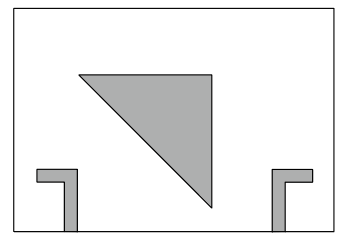

## 格子（Grid）

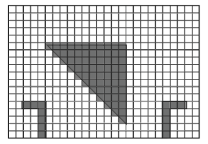

格子模型将地图分割为许多大小相等的格子，利用二维数组存储起来。使用各种值表示数组中对应的位置类型 如0用来表示障碍物，1表示可行走的区域。

优点：

- 实现简单
- 易于在运行时动态修改

缺点：

- 如果想更为细致地表达路径，则需要将格子分割地更小，从而导致内存占用更大且大范围寻路时计算代价更大

> 对于2D画面的小地图，是该模型最适合的场景。笔者在刚上大学时写过一个2D的塔防游戏，当时就是以这种方式来处理地图的（https://www.cnblogs.com/geek1116/p/5953456.html）


## 路径点（WayPoint）

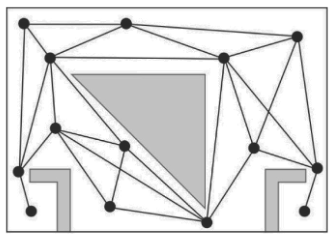

这种方式需要在手动标注出所有可以行走的点，这些点互相连接的直线就是单位行走的路径。通常在这些连接边上还需要带上权重，用邻接表的数据结构存储。

优点：

- 内存占用小
- 在此基础上做寻路算法的计算代价小

缺点：

- 需要人工添加路径点，且在地图变动后都需要再次调整路径点，工作量大
- 由于单位只能沿着路径点行走，行为方式在观感上会表现的较为生硬，不够灵活；在大地图范围寻路以及需要考虑单位碰撞的场景下，该问题更为明显

> 对于传统的固定线路的塔防中，WayPoint是非常适合的建模方式


## 导航网格（NavMesh）

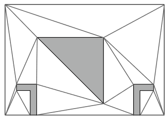

通过一系列的算法将可行走地形转换为由若干**凸多边形**组成的网格，并维护多边形之间的邻接关系。在导航网格中求两点之间的移动路径，需要根据两点所在的多边形以及多边形之间的邻接关系，按照某种寻路算法找出需要经过的所有多边形；再根据**拐点算法**计算途中的各个拐点来得出”平滑“的移动路径。

优点：

- 相比于前两种模型，NavMesh更能表达出地形的特征
- 适用于3D地形

缺点：

- 建模过程复杂，自己从零造轮子的话实现成本很大
- 不便于动态修改；在修改地形后再重新烘焙NavMesh的过程比较耗时，想要运行时执行这一过程的话性能代价较大

> Unreal Engine、Unity等游戏引擎中的导航系统内部原理都是基于NavMesh的


## 寻路算法

三种经典的路径规划算法：

- 广度优先搜索（BFS）
- Dijkstra最短路算法
- A*算法（A star）

在游戏开发中实现寻路问题时，A*算法通常是不二之选。这也是Unity中采用的寻路算法。

如果是以WayPoint的方式作地图建模的话，那么数据结构存储的是一个**无向加权图**，在此之上进行路径规划，Dijkstra算法通常会是一个合适的选择。


# 在塔防游戏中选择合适的寻路方案

回到我们的主题，要以Defense Grid为蓝本在Unity中实现敌人单位的寻路。

最简单粗暴是使用游戏引擎自带的导航系统，给定一个终点后剩下的都交给导航系统去处理了。这种方式下单位在地图上寻路时所走的都是**近似最短路**的路线。这种方式不能说是错的，但从游戏设计的角度讲 这种表现方式显得”很蠢“：在游戏实际运行中，敌人单位是一波一波出现的，但同一波次中的若干敌人在前进时会显得完全没有”集体意识“，大家都各自为战，最终会挤到同一条直线上。如下所示：

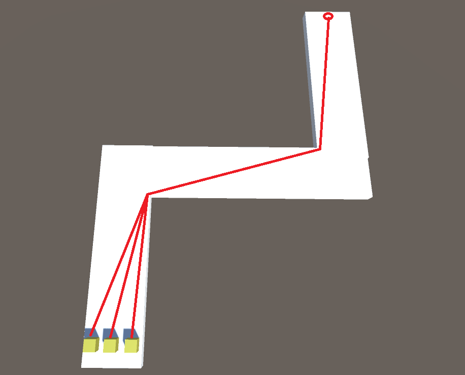

以右上方红点设为目的地，三个单位都只从自身位置考虑，算出当前到终点的最短路线；当经过第一个拐点后，它们仨都会位于同一直线上前行。

> 笔者曾关注过的塔防作品中确实见到过极个别真是这么实现的......


我们在前文提到过，对于固定路线的这类型地图寻路中可以采用WayPoint的方式建模，单位的前进路线则按着路径点之间的走，但这仍然会存在上述的问题。在Unity中做个demo，尝试下在两个拐点处放置路径点后，单位的移动效果：

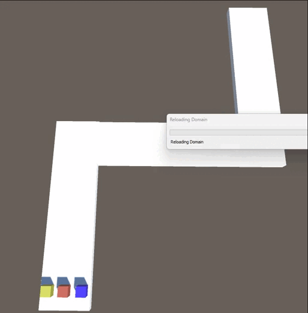


对比来看下模范生的表现：

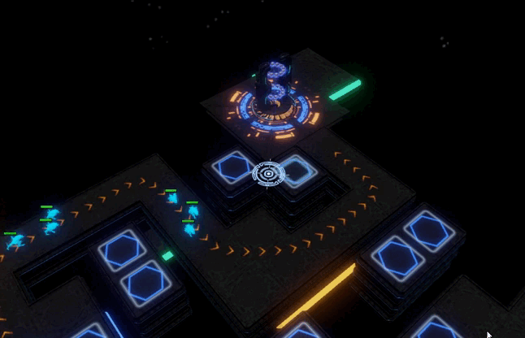

动图中每三个敌人为一波，前行方式类似于动物的群集行为；互相之间保持着一定距离，既不会碰撞也不会过远。

那么该如何实现同Defense Grid中一样的效果呢？观察游戏中的地面，可以看到是有一条金色箭头指示出敌人行动路径的。**所有敌人都沿着这条路径前行，但又不是完全贴合着指示路线进行移动的，而是存在一定的偏移**；并且同一波中每个敌人的偏移是不同的。这就如同在一条田径跑道上运动，每个单位都在自己的“赛道”上前进：


> 想象一下，你在如图的田径赛场上与同一波次的其他人站在起点上，并且每人都被分配了一条赛道。发令枪响后，你们都冲向了前方的同一目标点；但每个人都只能在自己的赛道中奔跑，不能够互相窜道。


## 模拟赛道机制

在上面Unity中实现WayPoint效果的那个demo基础上来模拟赛道机制。我们在场景中开始游戏后的流程是这样：

1. 初始化场景获取所有的路径点、出生点和终点
2. 在出生点按照一定间隔创建一波敌人
3. 为敌人设置下一个路径点并朝其移动
4. 到达当前路径点后，如果已经是终点就销毁，否则获取并设置下一个路径点


我们需要在每个人敌人实例化的时候，都为其分配一个`Vector3`类型的偏移位置。后续将它放置于出生点、设置目的路径点时，都需要在原坐标上加上这个偏移量：

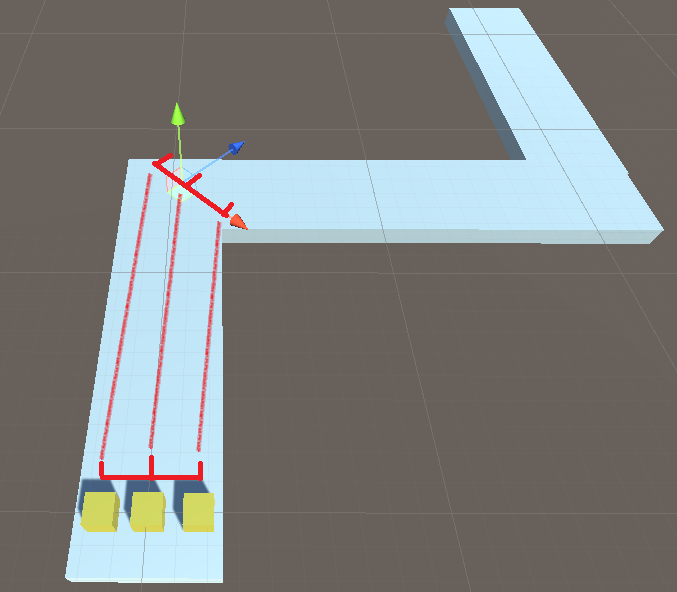

放置的路径点对象可能是存在旋转(Rotation)的，因此将偏移坐标加到原始坐标时需要注意从本地坐标到全局坐标的转换。


## 在路径点之间的移动

还有个没解决的问题就是如何控制敌人单位在目标点之间进行移动。虽然地形数据是基于WayPoint建模的，还需要做的似乎就是在两个路径点所连成的直线上移动敌人单位就可以了，但除此之外还有以下几点是需要考虑到的：

1. 不同单位的移动速度是不同的，因此会存在单位间碰撞的问题。涉及到碰撞检测以及如何作单位间彼此避开的机制。
2. 寻路中的单位经过拐角处时的处理。这里主要考虑的是动画的流畅性。
3. 动态障碍（下文会提到）。

以上这些点没必要自己造轮子，这里笔者是直接使用的Unity自己的导航系统。官方的导航系统都包办了以上功能，并且通过暴露的参数，能将各种效果做到**足够好用**了。并且我们没有的动态烘焙NavMesh的需求，需要导航寻路的地形都可以提前提前烘焙好；而内置的A*寻路算法，在我们只用在两个路径点之间的这种短距离寻路的场景下，也不容易产生性能瓶颈。


## 实现

### 烘焙地形

选中所有的地形，然后在Navigation -> Object选项中将其设为`Static`对象（2022之后的版本需要单独安装Navigation功能）：

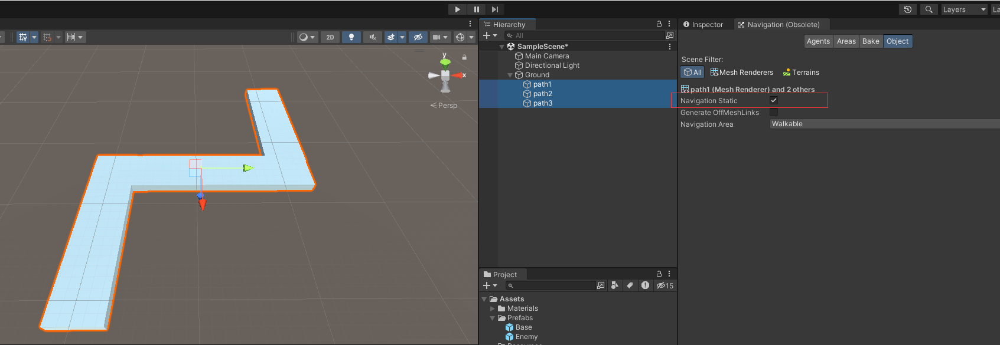

再在Back选项中点击开始烘焙：

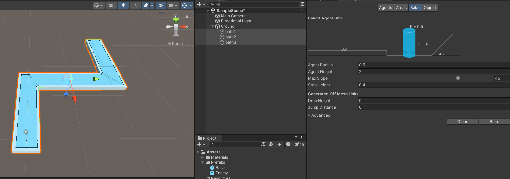

烘焙完成后，在地形上覆盖的一层谈蓝色的就是NavMesh了。


### 路径点

在场景中放置出生点和路径点，并创建一个对象专门用于管理所有的路径点以及在WayPoint结构上作寻路算法的具体实现。这里为了方便演示，暂时先用一维数组按顺序存储起来：

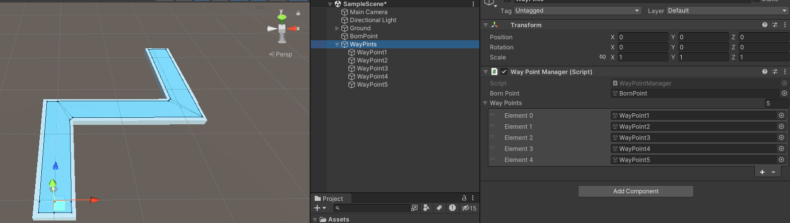

```c#
public class WayPointManager : MonoBehaviour
{
    [SerializeField]
    GameObject bornPoint;

    [SerializeField]
    GameObject[] wayPoints;

    static public GameObject BornPoint;

    static WayPointManager instance;

    void Start()
    {
        instance = this;
        BornPoint = bornPoint;
    }


    // 获取下一个路径点
    static public GameObject getNextDes(GameObject des)
    {
        if(!des)
        {
            return instance.wayPoints[0];
        }

        int idx = 0;
        for(int i = 0; i < instance.wayPoints.Length; ++i)
        {
            if(instance.wayPoints[i] == des)
            {
                idx = i;
                break;
            }
        }

        if(idx < instance.wayPoints.Length - 1)
        {
            return instance.wayPoints[idx + 1];
        }
        else
        {
            return null;
        }

        /*
         * todo: 后续寻路算法的实现
         */
    }
}
```


### 敌人单位

创建代表敌人单位的预制体，挂在上导航代理组件。这里还将`Angular Speed`和`Acceleration`参数调大了一些，使单位在转角处移动时更自然些：


挂载一个脚本控制单位自主沿着WayPoint路径寻路：

```c#
public class Enemy : MonoBehaviour
{
    private NavMeshAgent nav;

    private Vector3 offset;	// 偏移量

    private GameObject des;

    void Start()
    {
        nav = GetComponent<NavMeshAgent>();
        Transform bornTransform = WayPointManager.BornPoint.transform;
        transform.position = bornTransform.position + bornTransform.TransformDirection(offset);
    }

    
    public void init(Vector3 offset)
    {
        this.offset = offset;
    }
    

    void Update()
    {
        if(!nav.pathPending && nav.remainingDistance <= 0.5f)
        {
            GameObject origin = des ? des : WayPointManager.BornPoint;
            des = WayPointManager.getNextDes(des);
            
            if(des)
            {
                // 从from到end的方向向量
                Vector3 dir = des.transform.position - origin.transform.position;
                dir = new Vector3(dir.x, 0, dir.z).normalized;
                // 将方向向量转为四元数
                Quaternion dirQua = Quaternion.LookRotation(dir);
                // 得出真正的偏移量
                Vector3 realOffset = dirQua * offset;
                
                nav.SetDestination(des.transform.position + realOffset);
            }
            else
            {
                Destroy(this.gameObject);
            }
        }
    }
}
```

再创建个敌人工厂，用于生成各种类型的敌人单位：

```c#
[CreateAssetMenu]
public class EnemyFactory : ScriptableObject
{
    [SerializeField]
    Enemy prefabs;

    public Enemy Get()
    {
        return Instantiate(prefabs);
    }
}
```


### 生成测试敌人

创建游戏对象并挂载脚本，控制每波次的敌人生成：

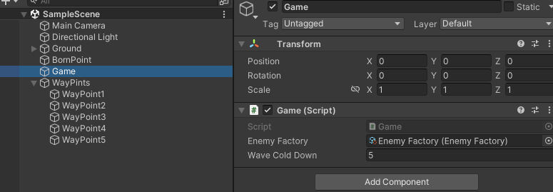

```c#
public class Game : MonoBehaviour
{
    public EnemyFactory enemyFactory;

    [SerializeField]
    float waveColdDown = 5.0f;

    private float progress = 5.0f;

    private Vector3[] bornOffset = { new Vector3(-1.5f, 0, 0), new Vector3(0, 0, 0), new Vector3(1.5f, 0, 0) };

    void Update()
    {
        progress += Time.deltaTime;
        if(progress >= waveColdDown)
        {
            progress = 0;
            
            for(int i = 0; i < bornOffset.Length; ++i)
            {
                Enemy enemy = enemyFactory.Get();
                enemy.init(bornOffset[i]);
            }
        }
    }
}
```


看下运行效果：

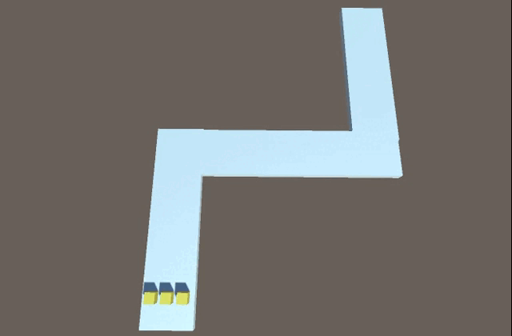


# 动态路障

下一个需要考虑的问题就是如何在路径上创建例如防御塔这类的动态障碍物，从而改变敌人单位的行走路线。

在烘焙导航网格时，所选中的地形和障碍物都会被设置位`Static`，在游戏运行时无法改变其位置。对于需要在运行时动态变化并影响到导航代理的障碍物对象，Unity提供了组件：导航网格障碍物（**NavMesh Obstacle**）。

使用方式非常简单，在障碍物对象上添加NavMesh Obstacle组件，并勾上`Carve`属性：

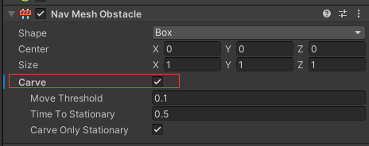

*carve*译为“雕刻”；开启了该属性的障碍物发生移动后，会重新烘焙其周围的导航网格。如果未开启，那么障碍物的移动将不会触发网格的重新烘焙而仅会阻碍导航代理的移动。

在运行时重新烘焙导航网格是一项非常昂贵的计算行为，因此不应滥用NavMesh Obstacle组件。对于`Carve`下属性，可以根据场景来设置合理的阈值以将计算代价降到最低：

| 属性名                | 说明                                                         |
| --------------------- | ------------------------------------------------------------ |
| Move Threshold        | 当移动距离超过该值时视其为移动状态。使用此属性可设置该阈值距离来更新移动的雕孔。 |
| Time To Stationary    | 将障碍物视为静止状态所需等待的时间（单位：秒）。             |
| Carve Only Stationary | 只有在静止状态时才会冲重新“雕刻”障碍物周围的导航网格。       |


## 测试

 我们来创建一个测试场景验证下效果：

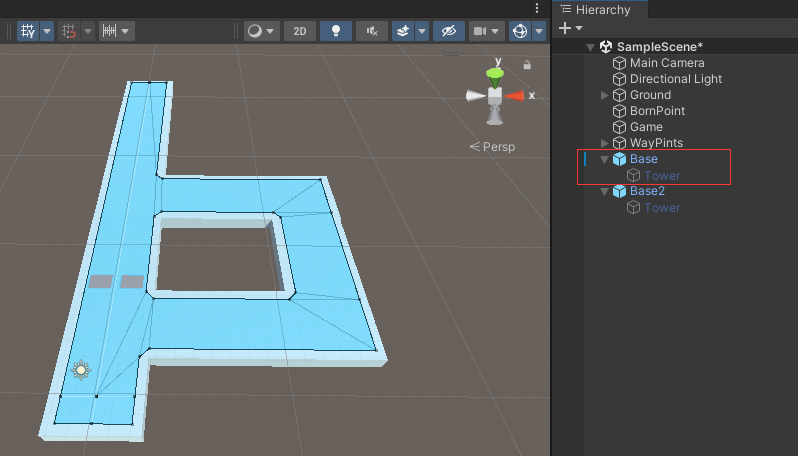

创建一个Base对象，赋值一个单独的layer：

Base拥有一个子对象Tower，给它挂载上NavMesh Obstacle组件，充当动态障碍物。这里我们让Tower默认为非`active`的状态。

Base身上挂载脚本ObstacleController，鼠标点击后生成动态障碍物：

```c#
public class ObstacleController : MonoBehaviour
{
    
    void Update()
    {
        if(Input.GetMouseButtonDown(0))
        {
            Ray ray = Camera.main.ScreenPointToRay(Input.mousePosition);
            RaycastHit hit = new RaycastHit();
            if(Physics.Raycast(ray, out hit))
            {
                int layer = hit.collider.gameObject.layer;
                if(layer == LayerMask.NameToLayer("Tower Base"))
                {
                    GameObject baseObj = hit.collider.gameObject;
                    Transform tower = baseObj.transform.Find("Tower");
                    if(tower)
                    {
                        tower.gameObject.SetActive(true);
                    }
                    else
                    {
                        Debug.Log("Not found tower!");
                    }
                }
            }
        }
    }
}
```

运行效果：

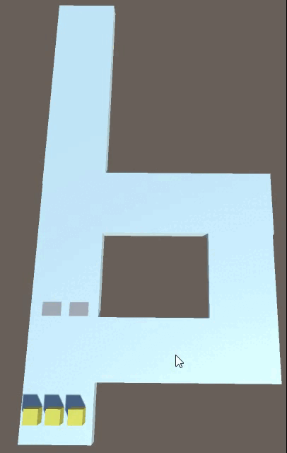


# WayPoint上的寻路算法

基于WayPoint建模上的寻路算法，最适合的莫过于**Dijkstra**算法了。Dijkstra是一种类似于广度优先搜索的方法，用于解决带权（非负权）图的单源最短路径问题。该算法的具体步骤文本就详述了，核心思想就两点：

- 每次选定一个点，满足：该点未被选中过，且是当前最短的可达距离
- 对这个点的所有邻边做**松弛**操作

示意图：


## 适配

代入到我们的场景中。如果以敌人单位的出生点作为图的起点，终点同理；边的权重就等值于两点之间的距离。

经过Dijkstra算法计算后可以得出起点到达所有点的最短距离是多少。并且在做松弛操作的过程中，我们可以记录当前可达的最小值是由哪个点计算而来的，将其标志为”前置点“。最后我们从终点开始，由”前置点“一步步倒推回至起点，就得到了一条敌人单位从起点出发，到达终点的最短路径了。

但我们还需要考虑几个问题：

1. 因为有动态障碍的存在，由WayPoint构成的图是会在游戏中发生变动的
2. 虽然我们可以在图发生变动后按照上述过程重新计算一遍得出最短路径，但重新得出的最短路径仍然只是从起点到达其他点的最短路径；而此时可能会存在许多敌人单位分散在不同的点上，它们在此刻所需要的是从自己所处的那个点到达终点的最短路径

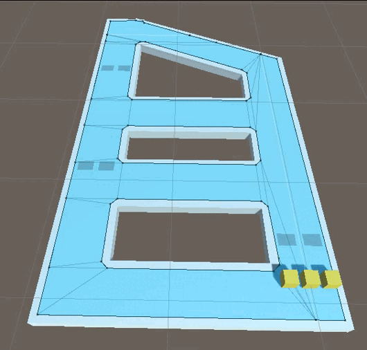

> 示例：不断变化的地图


首先想到最直接的解决办法是：如果敌人当前所处在的点不在”从起点到终点这一条最短路径“上时，就以当前点作为起点也做一遍Dijkstra计算，得到从此点出发的一条最短路径。这种方式可行，但有两点缺陷：

1. 使得寻路实现的复杂度提高
2. 当图结构发生改变后，如果刚好有多个敌人分散在各个点处，那么在一帧内要做多次最短路径算法的话计算压力会比较大


我们不妨逆向思考一下，既然Dijkstra算法是用于解决**单源**最短路径问题的，既**单个起点到其他所有点的最短路径**。那如果将地图中怪物单位的”终点“作为图的”起点“的话，推导一遍Dijkstra算法就能得到”终点“到达其他各个点的最短路径。而再利用上面讲到的”前置点“的字段，我们不就有了所有点到达终点的路径 :）


## 实现

### WayPoint

```c#
public class Waypoint : MonoBehaviour
{
    [SerializeField]
    public Waypoint[] linkPoints;

    [SerializeField]
    public Boolean isBorn, isEnd;

    public List<AdjoinPoint> adjoinPoints = new List<AdjoinPoint>();

    [NonSerialized]
    public Waypoint nextWayPoint = null;

    void Start()
    {
        // 初始化时生成所有的邻接边
        for (int i = 0; i < linkPoints.Length; ++i)
        {
            addLinkPoint(linkPoints[i]);
            linkPoints[i].addLinkPoint(this);   // // 同时也将当前点加入到对方的邻接点之中
        }
    }

    public void addLinkPoint(Waypoint point)
    {
        // 判断当前邻接点中是否已经包含了该点
        AdjoinPoint adjoinPoint = adjoinPoints.Find(adjPoint =>
        {
            if (adjPoint.point == point) return true;
            else return false;
        });
        // 如果未包含，则加入
        if(!adjoinPoint.point)
        {
            adjoinPoint.point = point;
            adjoinPoint.length = Vector3.Distance(transform.position, point.gameObject.transform.position);
            adjoinPoints.Add(adjoinPoint);
        }
    }
}

public struct AdjoinPoint
{
    public Waypoint point;
    public float length;
}
```

在Waypoint文件中我们还创建了一个`AdjoinPoint`结构体用来表示当前waypoint的所有邻接点。其中存储了一个代表邻接点的Waypoint对象以及一个length表示该条边的物理长度；这种数据结构是为了方便后续进行的Dijkstra算法计算。

为了在编辑器视图中方便查看，我们在Waypoint加入个`OnDrawGizmos`方法，绘制出所有点之间的连接线段：

```c#
void OnDrawGizmos()
{
    Gizmos.color = Color.blue;
    Gizmos.DrawSphere(transform.position + Vector3.up * 0.5f, 0.5f);

    for(int i = 0; i < linkPoints.Length; ++i)
    {
        Gizmos.color = Color.red;
        Gizmos.DrawLine(transform.position, linkPoints[i].transform.position);
    }
}
```

创建多一些waypoint：

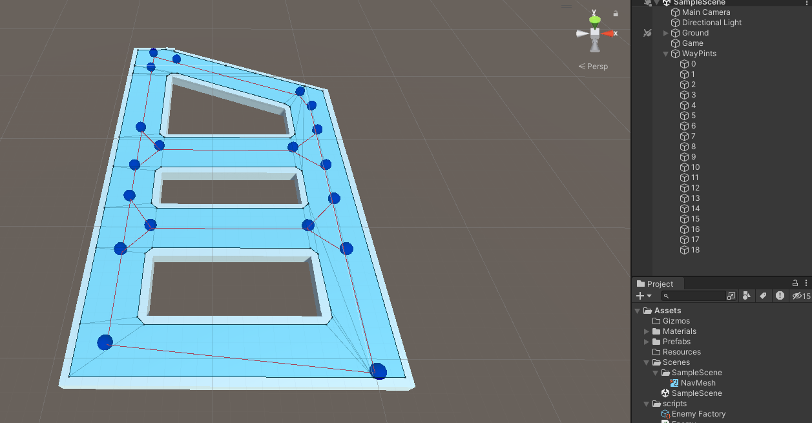


### WayPointManger

负责地图中所有waypoint的管理以及Dijkstra算法的实现者：

```c#
public class WayPointManager : MonoBehaviour
{
    [NonSerialized]
    public Waypoint[] wayPoints;

    static public Waypoint BornPoint, EndPoint;

    static public WayPointManager instance;

    void Start()
    {
        instance = this;

        wayPoints = GetComponentsInChildren<Waypoint>();

        for(int i = 0; i < wayPoints.Length; ++i)
        {
            if (wayPoints[i].isBorn) BornPoint = wayPoints[i];
            if (wayPoints[i].isEnd) EndPoint = wayPoints[i];
        }

        // 初始化寻路
        dijkstra();
    }


    // 获取下一个路径点
    static public Waypoint getNextDes(Waypoint des)
    {
        if (des == EndPoint) return null;

        Waypoint nextWayPoint = des.nextWayPoint;
        if(nextWayPoint)
        {
            return nextWayPoint;
        }
        else
        {
            Debug.LogError("无法找到正确的nextWayPoint");
            return null;
        }
    }


    /**
     * 使用Dijkstra算法，将地图终点作为寻路算法中的起点，反向搜索，找出所有点到达地图终点的路径
     * 
     * 根据WayPoint对象的名称来做数组下标
     * wayPoints数组中的下标顺序不一定和名称完全对应
     * WayPoint对象名称中数值的最大值，必须和wayPoints数组的长度相同
     */
    public void dijkstra()
    {
        int len = wayPoints.Length;
        float[] dis = new float[len];
        bool[] vis = new bool[len];
        Array.Fill(dis, float.MaxValue);
        Array.Fill(vis, false);

        int source = int.Parse(EndPoint.gameObject.name);
        dis[source] = 0f;

        for(int i = 0; i < len-1; ++i)
        {
            int node = -1;
            for(int j = 0; j < len; ++j)
            {
                // 找出当前距离源点最短的点 赋给node
                if (!vis[j] && (node == -1 || dis[j] < dis[node]))
                {
                    node = j;
                }
            }

            Waypoint shortestPoint = Array.Find(wayPoints, p => int.Parse(p.gameObject.name) == node);  // 根据名称找到对应的WayPoint

            // 遍历点该点的所有出边
            foreach(AdjoinPoint adjPoint in shortestPoint.adjoinPoints)
            {
                int j = int.Parse(adjPoint.point.gameObject.name);
                float newLen = dis[node] + adjPoint.length;
                if (newLen < dis[j])
                {
                    dis[j] = newLen;
                    adjPoint.point.nextWayPoint = shortestPoint;
                }
            }

            vis[node] = true;
        }
    }
}
```


运行游戏，现在敌人单位会沿着地图上的waypoint以最短的路径方式到达终点：

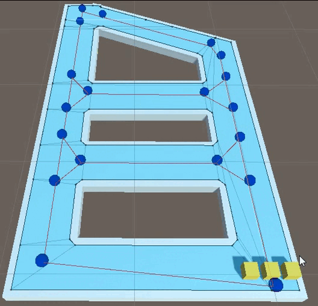


# 拓展

我们的塔防寻路算法到此基本就完成了。但目前的表现方式还是比较简单的，在策略上不够丰富。

在此基础上可以做许多其他的拓展，例如，除了waypoint之间的长度以外再另外根据游戏内规则来额外确定各条边的权重、在路径上放置许多的塔基以此来延长敌人单位的行进距离，并在必要时可以“闭合”掉某条边以此来改变整个地图的结构，从而大幅度更改敌人单位的走向：

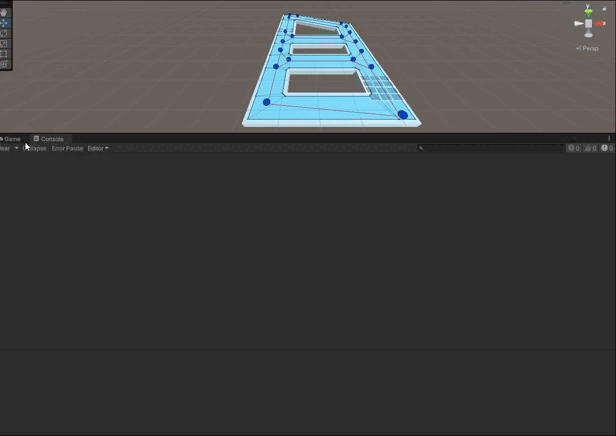

> 在游戏运行时调整地图结构