## 3D游戏美术流程

不同于其他类型的AI应用，3D内容的AI生成应用所面向的行业更加垂直，具有一定的专业使用门槛，并且生成的产物与直接投入生产环境的内容往往还存在一定的距离。笔者这里针对**3D游戏美术**流程，分享下在引入了AI生成后的美术工作流程。

首先了解下在行业中一个比较主流的美术工作流，大致如下：

```markdown
雕刻高模
   ↓
拓扑低模、布线
   ↓
  展UV
   ↓
由高模烘焙出法线、AO等贴图
   ↓
绘制颜色、金属度、粗糙度等PBR贴图
   ↓
制作骨骼、绑定、刷权重、测试蒙皮
   ↓
制作骨骼动画
   ↓
导入游戏引擎调试
```

通常来说其中每个步骤所使用的DCC工具都是不一样的，甚至同一步骤都能有多种工具可以选 例如建模阶段的3D Max（硬表面物体）和Maya（角色/生物建模）等。考虑到学习成本和独立开发的效率，笔者选择了全流程制作都使用Blender。这也是许多独立开发者的选择，毕竟作为个人和小微团队来说，采用行业最佳实践的美术工作流并不现实。


## AI工具选择

笔者共测评了四款拥有对游戏资产开发有一定支持的平台，分别是：

- 腾讯的混元3D：https://3d.hunyuan.tencent.com/
- Rodin的Hyper3D：https://hyper3d.ai/
- Tripo AI：https://www.tripo3d.ai/zh
- Meshy：https://www.meshy.ai


综合使用下来，混元3D和Tripo AI不管是在流程完整性还是生成内容的质量上，都是目前来看最好的。这两者还包括了组件拆分这一大多数竞品没有的功能支持。另外，腾讯混元3D中的3D Studio是完全针对游戏行业定制化的工作流，在前置流程上还可以衔接*腾讯混元游戏*（自家的另一个平台：https://hunyuan.tencent.com/game），提供了多种角色/道具/场景的概念设计工具。

笔者在挺久之前就有关注到腾讯混元3D并且挺看好的，但它一直没有进行商业化，目前每天只能获取非常少的固定生成次数来在平台内使用；而且3D Studio是需要单独去申请内测资格后才能使用的，生成的内容会有版权归属的问题。最终决定使用Tripo AI来辅助笔者3D美术工作。


## AI工具实践

首先需要准备好一张设计图；这一步的手段是非常的丰富的，手绘、外包画稿、疑惑是文生图/图生图等AI生成方式。笔者这里的例子是使用的之前自己手绘+AI融图出来的一张外星怪物设计图。打开Tripo AI的3D工作台，右侧面板中上传图片（为了提高生成的准确性，最好用多视图生成）：

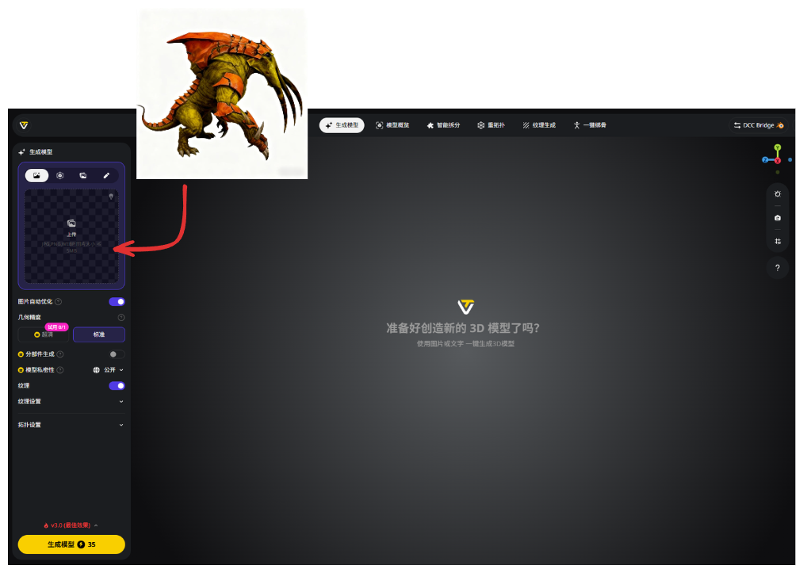

同时设置生成模型的参数。高清纹理和PBR属于鸡肋特性，开启与否都行，因为AI生成的纹理质量肯定是无法投入生产使用的。重要的参数是拓扑设置中的拓扑面和面数控制；其中的智能低模是Tripo新出的特性，笔者目前还未试用过。


点击生成，得到模型：

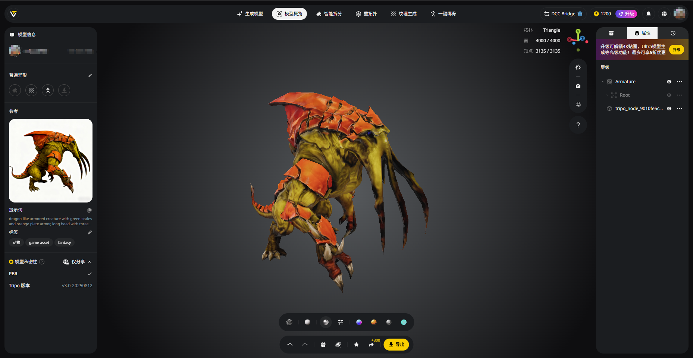

虽然开启了PBR纹理但看不出什么效果。

切换到白模，看下布线效果：


有点稀碎......

展UV的效果在应用里看不了，需要导入进Blender后再看。接着在下方设置导出，格式用`.FBX`，选个纹理分辨率，轴心重置到原点：

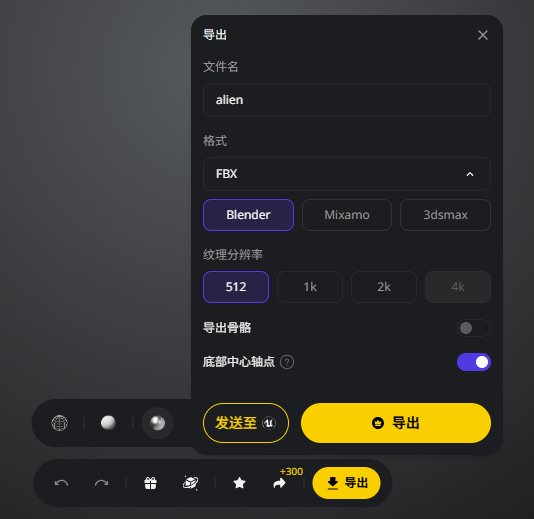


## 进入Blender中工作

新建Blender工程，将刚刚由Tripo AI导出的`FBX`文件导入进来。

在白模中首先检查下是否有破面、面朝向异常等问题：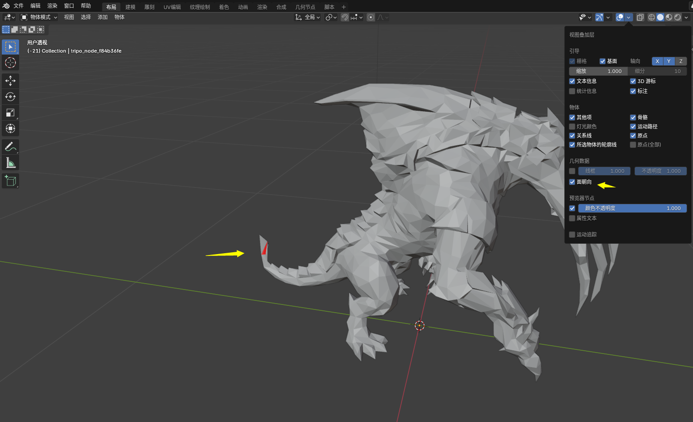

笔者导出的这个模型的尾巴处存在几片法向异常的面*<font color="gray">（4.x版本后只会对异常法向的面标红色）</font>*。

接着切换到UV编辑，看下UV展的效果：

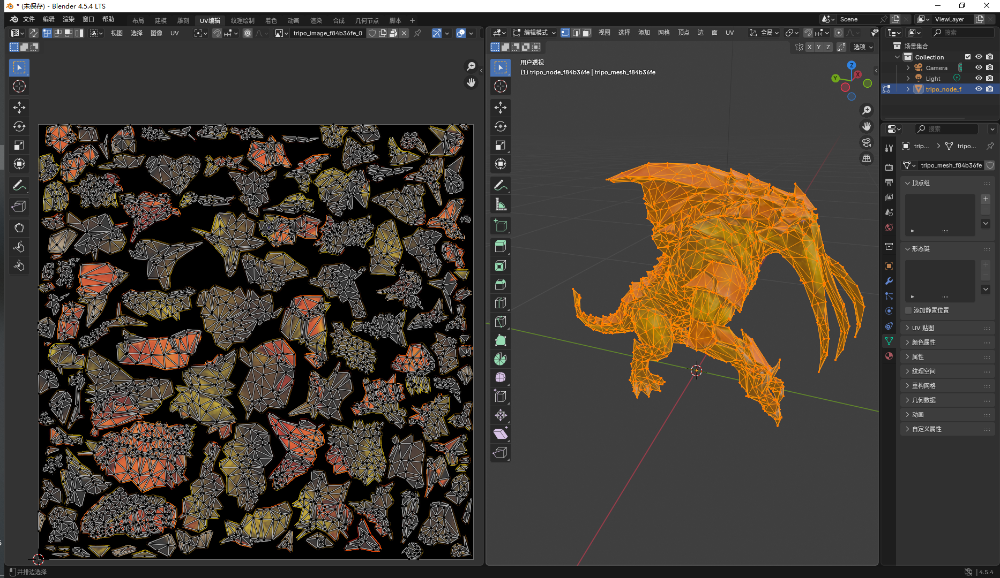

依旧稀碎......这拆的甚至还不如Blender内置的智能UV。考虑到后续的可维护性，最好还是调整下布线重新拆UV。

调整完后到着色器界面中将各个贴图依次重新烘焙出来以适配新的UV。最好再把贴图都输出到本地作为外部图像引用：

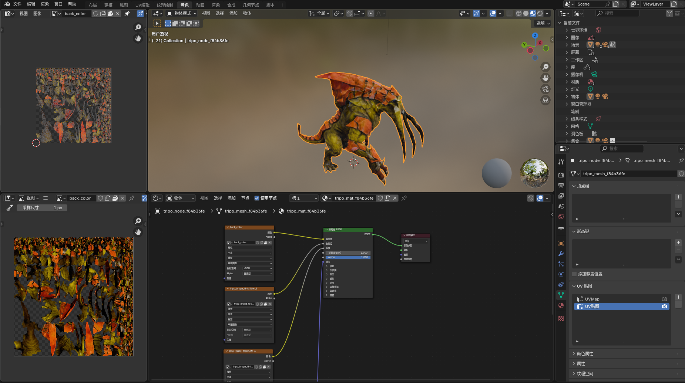

确保所有新贴图都无误后，下一步进入到纹理绘制。这里就是需要自己手绘调整各项贴图了：

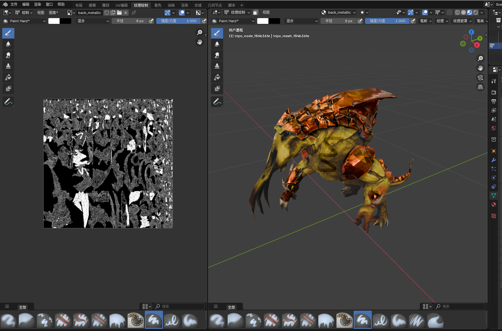

在unity中使用标准的urp材质的话，金属度和光滑度是共用一张贴图的：

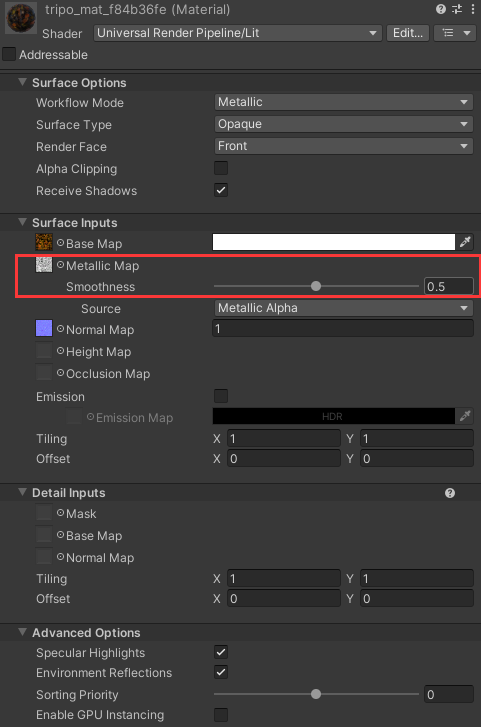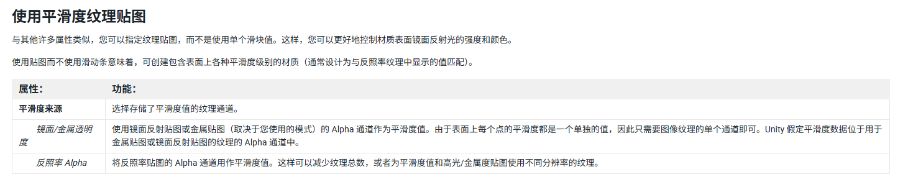

所以需要将着色材质中的金属度和粗糙度贴图进行通道合并。该步骤就是简单的图像操作，既可在PS这种软件中操作也可以在Blender的合成器中操作。笔者建议图像操作也都可以放在Blender中处理；不仅无需切换工作软件，而且合成器这一基于节点编辑器构建的工作流在后期维护也方便得多，随时修改材质贴图后能自动化完成转换贴图的工作：

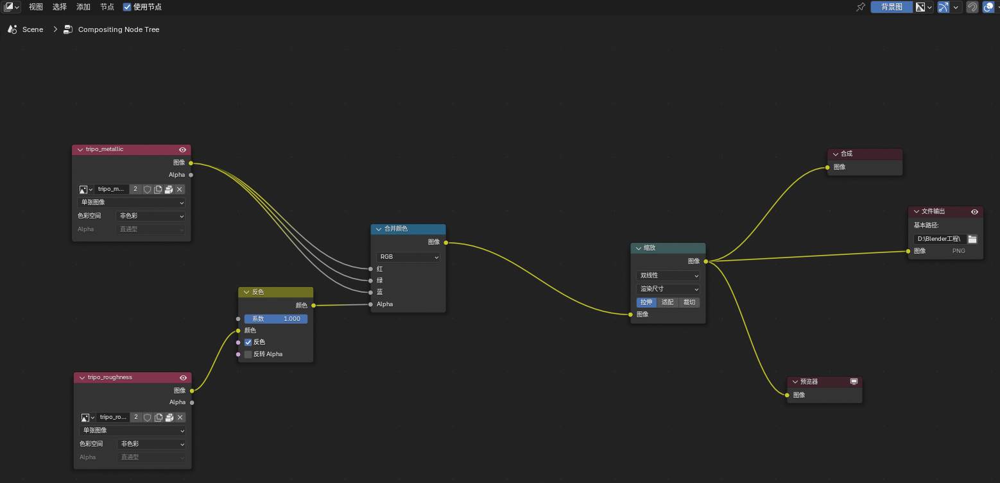

至此模型的静态部分完成。

还剩下骨骼制作、绑定和动画的工作了，这几块就需要完全由自己动手了。智能绑骨和动画目前还未找到可用的AI工具，尤其是非人形的生物。如果是人形的动画，可以借助Mixamo网站，这一免费动画平台对于小项目而言也足够了。

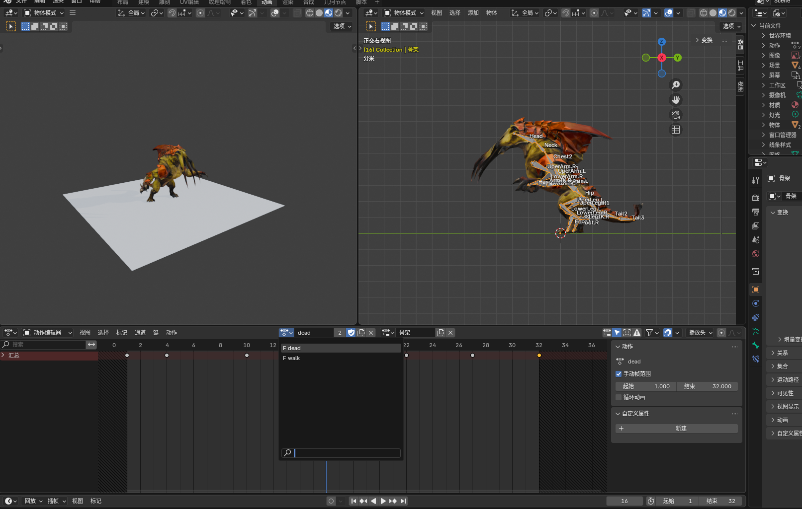*<font color="gray">制作一个行走和死亡动画</font>*


## 导入游戏引擎