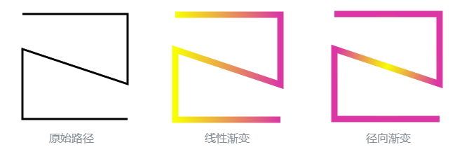
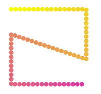
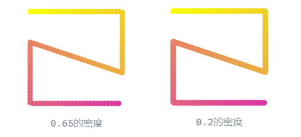
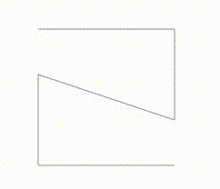

# 原生的渐变方法

在SVG中提供的原生渐变方法有两种，分别为线性渐变`linearGradient`和径向渐变`radialGradient`。我们以一个稍微复杂的路径来作为模板，为其添加两种渐变效果：

```xml
<svg width="800" height="300">
    <defs>
        <linearGradient id="linear-grad">
            <stop offset="0" stop-color="#f7ff00" />
            <stop offset="1" stop-color="#db36a4" />
        </linearGradient>
        <radialGradient id="radial-grad">
            <stop offset="0" stop-color="#f7ff00" />
            <stop offset="1" stop-color="#db36a4" />
        </radialGradient>

        <path id="grad-path" d="M 50,50 H 200 V 150 L 50,100 V 200 H 200"/>
    </defs>

    <use xlink:href="#grad-path" stroke="black" fill="none" stroke-width="3" />
    <use xlink:href="#grad-path" stroke="url(#linear-grad)" fill="none" stroke-width="9" x="250" />
    <use xlink:href="#grad-path" stroke="url(#radial-grad)" fill="none" stroke-width="9" x="500" />
</svg>
```

展示效果如下：



虽然这两种渐变类型还有许多其他的属性可以设置，但它们的渐变颜色始终是只能沿着某一方向直线分布的，无法满足我们希望颜色可以沿着任意路径作渐变的需求。

对于某些特殊的路径如`<circle>` 可以通过一些比较hack的方式来仅依靠CSS就能实现沿路径颜色渐变：例如这个[示例](https://css-tricks.com/my-struggle-to-use-and-animate-a-conic-gradient-in-svg/)。但我们需要的是足够通用的办法，可以做到任意路径上的颜色渐变；这就需要借助JavaScript来实现。


# 模拟渐变

既然SVG没有原生提供我们想要的渐变效果，就需要想想其他办法来“曲线救国”。

我们首先考虑下在Canvas画布中要实现沿路径渐变颜色是如何实现的：Canvas的2D上下文同样是只提供了线性渐变`createLinearGradient()`和径向渐变`createRadialGradient()`两种方法。但不同之处在于，Canvas画布是可以**逐像素绘制**颜色的。在绘制路径时根据渐变颜色做插值计算，得出每个像素应用的颜色值即可。

将这种思考迁移到SVG中来。尽管SVG是矢量图绘制，不支持像素级操作的；但通过方法`getTotalLength()`和`getPointAtLength()`可以获得路径的总长度及组成路径的这些离散点在SVG视图内的坐标。再利用`<circle>`图形来模拟“像素点”，依次摆放到前述的点坐标上，再设置对应的渐变颜色：



这些“像素点”越密集呈现的效果就越好。出于对页面性能的考虑，事先选定一个**合适的密度**很重要。

```html
<svg width="800" height="300">
    <defs>
        <path id="grad-path" d="M 50,50 H 200 V 150 L 50,100 V 200 H 200" />
    </defs>
    
    <g id="dots-container">
        <!-- 放置circle的容器 -->
    </g>
</svg>

<script src="https://cdn.jsdelivr.net/npm/d3@7"></script>
<script src="./createDots.js"></script>
```

这里引入*d3.js*库只是为了方便做颜色的插值计算。

```javascript
const strokeWidth = 9
const startColor = '#f7ff00', endColor = '#db36a4'
const gradientPath = document.querySelector('#grad-path')
const dotsContainer = document.querySelector('#dots-container')
// 选择合适的点间距来控制密度
//const dotsDensity = strokeWidth * 1.0
const dotsDensity = strokeWidth * 0.2
const numberOfDots = Math.ceil(gradientPath.getTotalLength() / dotsDensity)

createDots()


function createDots() {
    for(let i = 0; i < numberOfDots; ++i) {
        const circle = document.createElementNS('http://www.w3.org/2000/svg', 'circle')
        dotsContainer.appendChild(circle)

        const steps = i / numberOfDots
        // 计算坐标点
        const pos = gradientPath.getPointAtLength(steps * gradientPath.getTotalLength())
        circle.setAttribute('cx', pos.x)
        circle.setAttribute('cy', pos.y)
        circle.setAttribute('r', strokeWidth / 2)
        // 计算颜色插值
        const interpolator = d3.interpolate(startColor, endColor)
        const curColor = interpolator(steps)
        circle.setAttribute('fill', curColor)
    }
}
```




# 动画

接下来我们再为其加入动画，使渐变颜色沿着路径移动来产生动效。

```html
<svg width="800" height="300">
    <defs>
        <path id="grad-path" d="M 50,50 H 200 V 150 L 50,100 V 200 H 200" />
    </defs>
    
    <use xlink:href="#grad-path" stroke="#868e96" fill="none" stroke-width="1" />
    <g id="dots-container">
        <!-- 放置circle的容器 -->
    </g>
</svg>

<script src="https://cdn.jsdelivr.net/npm/d3@7"></script>
<script src="./test.js"></script>
```

除了渐变色外，定义动效的宽度、高度及时长：

```javascript
const startColor = '#f7ff00', endColor = '#db36a4'
const gradientPath = document.querySelector('#grad-path')
const dotsContainer = document.querySelector('#dots-container')
// 动效的宽高
const strokeWidth = 9
const effectLength = 100
// 选择合适的点间距来控制密度
const dotsDensity = strokeWidth * 0.4
const numberOfDots = Math.ceil(effectLength / dotsDensity)
// 动画时长
const duration = 1500
```


根据配置创建所有的像素点，初始化颜色与半径等属性后将其引用存储起来：

```javascript
// 初始化所有点
const dots = []
createDots()

function createDots() {
    for(let i = 0; i < numberOfDots; ++i) {
        const circle = document.createElementNS('http://www.w3.org/2000/svg', 'circle')
        dotsContainer.appendChild(circle)
        
        const color = d3.interpolate(startColor, endColor)(i / numberOfDots)
        circle.setAttribute('fill', color)
        circle.setAttribute('display', 'none')
        circle.setAttribute('r', strokeWidth / 2)

        dots.push(circle)
    }
}
```


执行动画。由`window.requestAnimationFrame`决定动画的帧数。传入每帧的回调函数，从动效的尾部开始处理，由`dotsDensity`做像素点的间隔向前依次更新位置，对于不在路径范围内的点做隐藏处理：

```javascript
window.requestAnimationFrame(animationTask)
let startTime = -1
function animationTask(timestamp) {
    if(startTime === -1) {
        startTime = timestamp
    }

    const process = (timestamp - startTime) / duration
    // 动效的终点坐标
    const tailIdx = process * gradientPath.getTotalLength()
    for(let i = numberOfDots - 1; i >= 0; --i) {
        const posIdx = tailIdx - (numberOfDots - i) * dotsDensity
        const hide = posIdx < 0 || posIdx > gradientPath.getTotalLength()

        const pos = gradientPath.getPointAtLength(posIdx)
        
        updateDot(i, pos, hide)
    }

    window.requestAnimationFrame(animationTask)
}

function updateDot(idx, pos, isHide) {
    const circle = dots[idx]

    if(isHide) {
        circle.setAttribute('display', 'none')

    } else {
        circle.setAttribute('display', 'inline')
        circle.setAttribute('cx', pos.x)
        circle.setAttribute('cy', pos.y)
    }
}
```


最终效果如下~🎊


