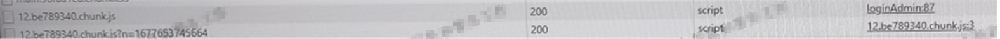

#### 问题描述

项目现场的前端项目在点击顶部的导航栏切换不同的模块时，会有小概率出现模块加载报错的情况：


我们的前端项目里是有基于`react-loadable`做的懒加载的，上图的`12.be789340.chunk.js`就是懒加载需要请求的模块。现场复现问题时出错的模块每次都可能不一样，并且出现问题的频率也挺稳定的，差不多每一二十次就会出现一次这种情况。

在复现出问题时，再看到网络请求的面板：



可以看到，先是有一个正常的js文件请求，接着会再发出一个相同地址的请求但后缀带上了个从没见过的参数。并且看到在最右侧一列，第二个请求发出的地方是`12.be789340.chunk.js:3`，是在上一个js文件里发出的！

看完请求面板这里，再结合控制台的`(missing: xxx.js)`报错，几乎可以断定是我们的js脚本被第三方劫持了。劫持了第一个请求后将里边的内容都替换为自己的，加载完后执行的就是它们的代码，然后再重新发送一次请求，这次请求加载到的内容才是我们前端项目里真正的代码。并且还带上了参数用来标识。


#### webpack动态加载原理

虽然第一个js脚本的请求被劫持了，但不是接着就发送了第二个请求去加载真正的js内容了吗？为何还会报上图的错误呢。这要从webpack动态加载模块的实现说起。

懒加载模块是利用ES10的新特性`import()`方法来完成的，经过webpack编译后如下：

```javascript
// This file contains only the entry chunk.
// The chunk loading function for additional chunks
__webpack_require__.e = function requireEnsure(chunkId) {
	var promises = [];


	// JSONP chunk loading for javascript

	var installedChunkData = installedChunks[chunkId];
	if(installedChunkData !== 0) { // 0 means "already installed".

		// a Promise means "currently loading".
		if(installedChunkData) {
			promises.push(installedChunkData[2]);
		} else {
			// setup Promise in chunk cache
			var promise = new Promise(function(resolve, reject) {
				installedChunkData = installedChunks[chunkId] = [resolve, reject];
			});
			promises.push(installedChunkData[2] = promise);

			// start chunk loading
			var head = document.getElementsByTagName('head')[0];
			var script = document.createElement('script');
			var onScriptComplete;

			script.charset = 'utf-8';
			script.timeout = 120;
			if (__webpack_require__.nc) {
				script.setAttribute("nonce", __webpack_require__.nc);
			}
			script.src = jsonpScriptSrc(chunkId);

			onScriptComplete = function (event) {
				// avoid mem leaks in IE.
				script.onerror = script.onload = null;
				clearTimeout(timeout);
				var chunk = installedChunks[chunkId];
				if(chunk !== 0) {
					if(chunk) {
						var errorType = event && (event.type === 'load' ? 'missing' : event.type);
						var realSrc = event && event.target && event.target.src;
						var error = new Error('Loading chunk ' + chunkId + ' failed.\n(' + errorType + ': ' + realSrc + ')');
						error.type = errorType;
						error.request = realSrc;
						chunk[1](error);
					}
					installedChunks[chunkId] = undefined;
				}
			};
			var timeout = setTimeout(function(){
				onScriptComplete({ type: 'timeout', target: script });
			}, 120000);
			script.onerror = script.onload = onScriptComplete;
			head.appendChild(script);
		}
	}
	return Promise.all(promises);
};
```

对于需要加载的模块`chunkId`，流程如下：

1. 设置`installedChunkData[chunkId]`，标记该模块正在加载。

2. 创建`<script/>`标签，并插入页面中，开始加载js脚本。

3. 加载完js脚本后会立即执行。在由webpack打包出来的chunk中，会执行`webpackJsonpCallback`函数。在该函数中，会修改`installedChunks[chunkId] = 0`，并且还会执行`installedChunks[chunkId]`数组中的第一个函数也就是上面那个`promise`的`resolve`函数，将`__webpack_require__.e`函数中返回的`promise`变成成功状态。   `webpackJsonpCallback`函数的代码如下：

   ```javascript
   // install a JSONP callback for chunk loading
   function webpackJsonpCallback(data) {
   	var chunkIds = data[0];
   	var moreModules = data[1];
   	var executeModules = data[2];
   
   	// add "moreModules" to the modules object,
   	// then flag all "chunkIds" as loaded and fire callback
   	var moduleId, chunkId, i = 0, resolves = [];
   	for(;i < chunkIds.length; i++) {
   		chunkId = chunkIds[i];
   		if(installedChunks[chunkId]) {
   			resolves.push(installedChunks[chunkId][0]);
   		}
   		installedChunks[chunkId] = 0;
   	}
   	for(moduleId in moreModules) {
   		if(Object.prototype.hasOwnProperty.call(moreModules, moduleId)) {
   			modules[moduleId] = moreModules[moduleId];
   		}
   	}
   	if(parentJsonpFunction) parentJsonpFunction(data);
   
   	while(resolves.length) {
   		resolves.shift()();
   	}
   
   	// add entry modules from loaded chunk to deferred list
   	deferredModules.push.apply(deferredModules, executeModules || []);
   
   	// run deferred modules when all chunks ready
   	return checkDeferredModules();
   };
   ```

4. 执行完后，执行`<script/>`的onload回调，也就是上面的`onScriptComplete`函数。如果加载成功，会有`installedChunks[chunkId] === 0`，则无需做任何操作。否则的话，说明资源加载出错，执行`reject(error)`抛出异常。


捋清了webpack动态加载chunk文件的流程，导致报错问题的真正原因也就清楚了。我们把导致问题的整个流程也梳理一遍：

1. webpack的运行时 向页面中插入需要动态加载的chunk的`<script/>`标签，并添加`onload`回调。
2. `<script/>`标签发起请求，但是被拦截了并返回篡改后的代码。
3. 浏览器接收到篡改后的js脚本后立即执行。由于里面并不是我们前端项目中的chunk的内容，所有并不会有执行`installedChunks[chunkId] = 0`这一步。
4. 第[3]步执行完后，触发`<script/>`的`onload`回调。在回调函数中，因为判断到`installedChunks[chunkId] !== 0`，所以`reject(error)`抛出异常。
5. 在篡改的代码内容中，最后还会再请求一次真正的chunk内容。而这个chunk中的代码执行后就算设置了`installedChunks[chunkId] = 0`并调用`resolve()`也已经没有作用了，因为对应的`promise`在前面已经被`reject`掉了。


#### 解决办法

- 使用https来加密传输的数据。对于运营商劫持的情况，用https连接就可以很大程度上解决问题。
- 对于笔者的这种情况，是由于项目现场内网环境的一些特殊原因造成的并且没法干预，只能想办法绕开：通过前文对导致报错问题流程的梳理，我们知道是因为第一个执行了篡改内容的`<script/>`提前先触发了`onload`回调（即`onScriptComplete`函数），才导致了webpack报错。因此我们采用的临时解决办法就是覆写`Element.prototype.appendChild`方法，使得在`document.head.appendChild(script)`添加`<script/>`标签并且资源是属于webpack的动态加载的chunk时，就给原`script.onload`的回调加上一个延时后再执行（但不要超过`script.timeout`）。因为在chunk中的js代码执行时调用的`webpackJsonpCallback`函数会将`__webpack_require__.e`中的`promise`给`resolve`掉，所以`onload`回调是否执行并不影响webpack动态加载的流程，回调中的代码只是处理 在出错时能够抛出异常的逻辑而已。